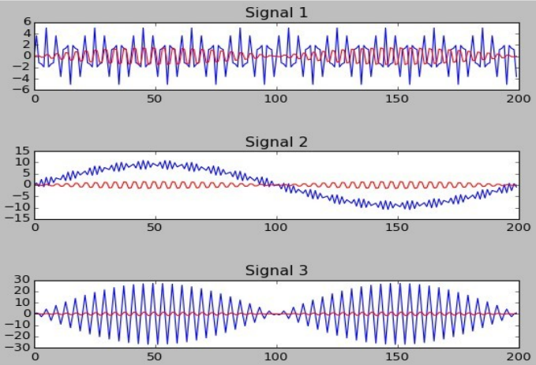

# 📘 README – Proyecto #1 INFO1157

## 📌 Descripción General

Este documento contiene los enunciados originales del proyecto junto con indicaciones claras de qué debes hacer en cada caso, incluyendo orientación técnica para su correcta implementación.

---

# 🧩 Problema 1 – FFT de Señales

## 📄 Enunciado

> El manejo de señales es fundamental en Arquitectura de Hardware. Este problema tiene que ver con la aplicación de la transformada rápida de Fourier (FFT). La FFT se utiliza principalmente para obtener las frecuencias presentes en una señal. Utilizando numpy se puede calcular la FFT. Utilizando el siguiente script obtenga las gráficas y la FFT de las señales. Explique claramente sus resultados.
>
> ¡Investigar FFT con numpy!

---

## 💻 Código entregado

```python
import numpy as np, matplotlib.pyplot as plt

FREQ_0 = 1000    # Frecuencia main
FREQ_1 = 50      # Frecuencia Ruido
SAMPLE = 44100   # Muestras por Segundo
S_RATE = 44100.0 # Tasa de Muestreo

s_1 = [np.sin(2*np.pi * FREQ_0 * i/S_RATE) for i in range(SAMPLE)] # 1000 Senos c/1s
s_2 = [np.sin(2*np.pi * FREQ_1 * i/S_RATE) for i in range(SAMPLE)] # 50 Senos c/1s
w_1 = np.array(s_1) ; w_2 = np.array(s_2)  # Listas a Array
wi2 = w_1 + w_2                           # Sumamos 2 ondas
```

---

## 🛠️ Qué debes hacer

* **No debes crear otro código base**, este ya genera las señales.
* Debes agregar:

  1. Gráfica en el tiempo (señal combinada)
  2. Aplicar FFT (`np.fft.fft`)
  3. Graficar la FFT

---

## 🧠 Qué debes explicar

* Por qué aparecen picos en:

  * 1000 Hz
  * 50 Hz
* Diferencia entre dominio del tiempo y frecuencia
* Cómo la FFT separa señales mezcladas

---

# 🧩 Problema 2 – Filtro Complementario

## 📄 Enunciado

> Utilizando el siguiente script grafique los datos mediante Matplotlib de Python utilizando el Filtro Complementario aplicados a las señales aS[0], aS[1] y aS[2]. Explique claramente sus resultados.


```python
import numpy as np, matplotlib.pyplot as plt

FREQ_0 = 9000 ; FREQ_1 = 5000; FREQ_2 = 100  # Frecuencia 1, 2 y 3
SAMPLE = 20000 ; S_RATE = 20000.0 # Samples y Tasa de Muestreo
nMAX = 20000
# Ondas...
aW = [
  [2*np.sin(2*np.pi * FREQ_0 * i/S_RATE) for i in range(SAMPLE)],
  [3*np.sin(2*np.pi * FREQ_1 * i/S_RATE) for i in range(SAMPLE)],
  [9*np.sin(2*np.pi * FREQ_2 * i/S_RATE) for i in range(SAMPLE)]
  ]
#Signals...
aS = [
  np.array(aW[0]) + np.array(aW[1]),
  np.array(aW[0]) + np.array(aW[2]),
  np.array(aW[1]) * np.array(aW[2])
  ]

def Filter_Comp(aV, nA):
  aF[0] = aV[0]
  for i in range(1,nMAX):
    aF[i] = nA * aV[i] + (1.0 - nA) * aF[i-1]
  return aF
```


<p align="center">
  
</p>

> En las gráficas anteriores, las curvas azules son señales de aS originales y las rojas son las señales aS con Filtro Complementario.

---

## 🛠️ Qué debes hacer

* Usar el script entregado (no modificar estructura principal)
* Graficar:

  * Señales originales (azul)
  * Señales filtradas (rojo)

---

## 🧠 Qué debes explicar

* Qué es un filtro complementario:

  * Combina componentes de alta y baja frecuencia
* Qué mejora:

  * Reduce ruido
  * Estabiliza la señal

---

# 🧩 Problema 3 – Control de Reproductor

## 📄 Enunciado

> Realice un programa en Python que controle el funcionamiento del WIMAMP o AIMP mediante el control de sus teclas asignadas para: PLAY, STOP, VOLUMEN +, VOLUMEN-, NEXT, PREVIOUS, PAUSE, etc. Utilice Win32Api de Python con el método User32.Keybd_event(.) para simular la presión y liberación de las teclas. Implemente un protocolo de comunicación serial mediante la utilización de VSPE. La aplicación cliente envía los comandos a la aplicación server que controla el reproductor de audio. Sea creativo e investigue afondo. Debe tener a lo menos 10 arhivos mp3/mp4 para ser reproducidos por el media player de su elección.

Ver explicación y guía de uso detallada: [README_Problema3_Explicacion.md](README_Problema3_Explicacion.md)

---

## 🛠️ Qué debes hacer

### ✔ Reproductor

* Puedes usar:

  * AIMP (recomendado)
  * Winamp

👉 No necesitas una canción específica
👉 Solo debes tener **mínimo 10 archivos mp3/mp4**

---

### ✔ Control por teclado

Debes simular teclas como:

* Play
* Stop
* Next
* Previous
* Volumen

Usando:

```python
win32api.keybd_event()
```

---

### ✔ Arquitectura cliente-servidor

Debes implementar:

* **Cliente**

  * Envía comandos (ej: "PLAY")

* **Servidor**

  * Recibe comandos
  * Ejecuta acciones

---

### ✔ Comunicación serial

* Usar **VSPE**
* Simular puertos COM

---

## 🧠 Qué debes explicar

* Flujo del sistema:

  ```
  Cliente → Serial → Servidor → Reproductor
  ```
* Cómo los comandos se traducen en acciones reales

---

# 🧩 Problema 4 – Generación de Audio WAV

## 📄 Enunciado

> Utilizando el módulo Wave de Python, genere los siguientes archivos de sonido [.WAV]. Cada nota debe durar 1 segundo. Investigue y utilice pack y unpack del módulo struct para preparar los datos de audio. Explique claramente sus resultados.
>
> 1. Escala Musical Pentatónica: Do, Re, Mi, Fa, Sol, La y Si, a una tasa de sampleo de 44.100 en Mono.
> 2. Escala Musical Pentatónica: Si, La, Sol, Fa, Mi, Re y Do, a una tasa de sampleo de 22.050 en Stereo.
> 3. Escala Musical Pentatónica: Do, Re, Mi, Fa, Sol, La y Si, a una tasa de sampleo de 8.000 en Mono.
> 4. Genere la siguiente onda en stereo (RATE=44.100) durante 10s y visualice con Audacity:
>    y = 8.000*sin(2*pi*500.0/RATE*i) + 8.000*sin(2*pi*250.0/RATE*i), i = 0,1,.. RATE
> 5. Baje el volumen de la onda anterior en un 75% utilizando Python.
> 6. Limpie el canal izquierdo de la señal anterior con Python y reproduzca con Audacity.
> 7. Utilice el software Audacity para analizar y reproducir los sonidos.
>
> ¡Investigar!

---

## 🛠️ Qué debes hacer

### 🎵 Generación de notas

Debes generar audio desde cero usando:

* `wave`
* `struct.pack`

---

### 🔑 CLAVE (importante)

Tal como te dijo el profesor:

👉 Debes investigar la fórmula de frecuencias musicales:

[
f = 440 \cdot 2^{\frac{n}{12}}
]

Esto te permite generar notas correctamente.

---

### 🎼 Escalas

* Cambiar:

  * Sample rate (44100, 22050, 8000)
  * Mono / Stereo
* Cada nota dura 1 segundo

---

### 🔊 Parte 4 – Señal compuesta

* Generar señal con dos frecuencias:

  * 500 Hz
  * 250 Hz
* Duración: 10 segundos
* Stereo
* Ver en Audacity

---

### 🔉 Parte 5 – Bajar volumen

* Multiplicar amplitud por:

  ```
  0.25
  ```

---

### 🎚️ Parte 6 – Limpiar canal izquierdo

Opciones válidas (elige y justifica):

#### ✔ Opción simple

* Canal izquierdo = 0

#### ✔ Opción intermedia

* Promediar canales

#### ✔ Opción avanzada (recomendado)

* Usar FFT para eliminar componentes
* Aplicar filtros digitales

---

### 💡 Ideas que puedes proponer (muy importante)

Siguiendo lo que dijo tu profesor:

* Decimación (reducir tasa de muestreo)
* Filtros FIR/IIR
* Transformada inversa (IFFT)
* Eliminación de frecuencias específicas

👉 No hay una única solución correcta
👉 Lo importante es que **funcione y lo expliques bien**

---

### 🎧 Parte 7 – Audacity

Debes:

* Visualizar ondas
* Analizar frecuencias
* Revisar canales stereo

---

# 🧠 Conclusión

Este proyecto evalúa:

* Procesamiento de señales
* Programación en Python
* Manejo de audio digital
* Integración de sistemas
* Capacidad de investigación

---

# 📅 Entrega

* Individual o en pareja
* Defensa obligatoria
* Fecha: 30 de abril

---

# 🚀 Recomendación final

* No basta con que funcione
* Debes:

  * Entender todo
  * Explicarlo claramente
  * Justificar decisiones técnicas

---

**Instalación y ejecución**

- **Crear entorno virtual (Windows CMD / PowerShell)**:

  - CMD:

    python -m venv venv
    venv\Scripts\activate

  - PowerShell:

    python -m venv venv
    .\venv\Scripts\Activate.ps1

- **Instalar dependencias**:

  pip install -r requirements.txt

- **Descargas externas necesarias**:

  - VSPE (Virtual Serial Ports Emulator) — para crear pares de puertos COM virtuales.
  - Un reproductor (AIMP recomendado o Winamp) con al menos 10 archivos mp3/mp4.

- **Configuración sugerida para Problema 3**:

  1. Crear un par de puertos virtuales en VSPE, por ejemplo `COM5 <-> COM6`.
  2. Ejecutar el servidor en el extremo que controla el reproductor (ej: escucha `COM5`).
  3. El cliente (o la GUI) envía comandos al puerto opuesto (`COM6`) que estarán redirigidos a `COM5`.

- **Comandos rápidos**:

  - Ejecutar la interfaz gráfica (GUI):

    python src/gui.py

  - Iniciar servidor manualmente (si no usas la GUI):

    python src/problem3_server.py --port COM5

  - Enviar comando desde cliente (ejemplo):

    python src/problem3_client.py --port COM6 PLAY

- **Notas / Problemas comunes**:

  - En Windows debes usar pywin32 (incluido en `requirements.txt`). Si hay problemas con `win32api` instala manualmente:

    pip install pywin32

  - Asegúrate que el reproductor (AIMP/Winamp) está en primer plano o acepta las teclas multimedia dependientes del sistema.
