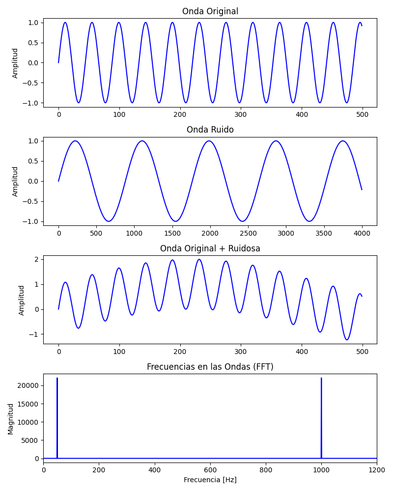

# Explicación de Resultados – Problema 1

### Que es FFT?
- Es un algoritmo altamente eficiente para calcular la transformada

---

## 1. Onda Original (1000 Hz)
- **Descripción:** Señal senoidal pura de 1000 Hz durante las primeras 500 muestras (≈ 0.011 segundos a 44100 Hz).
- **Interpretación:** Se observa una onda rápida y regular. A 1000 Hz completa 1000 ciclos por segundo, por eso en tan pocas muestras ya se ven varios ciclos completos.

---

## 2. Onda Ruido (50 Hz)
- **Descripción:** Señal senoidal de 50 Hz durante las primeras 4000 muestras (≈ 0.09 segundos a 44100 Hz).
- **Interpretación:** Es una onda mucho más lenta que la original. A 50 Hz completa 50 ciclos por segundo, por eso se necesitan más muestras para ver ciclos completos. Representa el ruido que se suma a la señal principal.

---

## 3. Onda Original + Ruidosa
- **Descripción:** Suma de ambas señales durante las primeras 500 muestras (misma ventana que la señal original).
- **Interpretación:** La onda rápida de 1000 Hz aparece "envuelta" por la onda lenta de 50 Hz. Cuando ambas van en fase su amplitud llega a 2.0, cuando van en contrafase se restan y la amplitud baja. Esto se llama interferencia constructiva y destructiva.

---

## 4. Frecuencias en las Ondas (FFT)
- **Descripción:** Transformada Rápida de Fourier (FFT) de la señal combinada, mostrada entre 0 y 1200 Hz.
- **Interpretación:** Se observan exactamente dos picos:
  - Uno en **50 Hz** → la señal de ruido
  - Uno en **1000 Hz** → la señal original

  La FFT confirma que la señal combinada está compuesta únicamente por esas dos frecuencias. Si el ruido fuera aleatorio (ruido blanco), no habría un pico limpio sino energía distribuida en todas las frecuencias.

---

## Conceptos clave

- **Dominio del tiempo** (gráficas 1, 2 y 3): muestra cómo varía la amplitud de la señal muestra a muestra.
- **Dominio de la frecuencia** (gráfica 4): muestra qué frecuencias componen la señal. La FFT descompone cualquier señal en una suma de senoidales, permitiendo identificar sus componentes aunque estén mezcladas.
- **Interferencia:** al sumar dos senoidales de distinta frecuencia, la amplitud resultante varía en el tiempo según si las ondas se refuerzan o se cancelan entre sí.