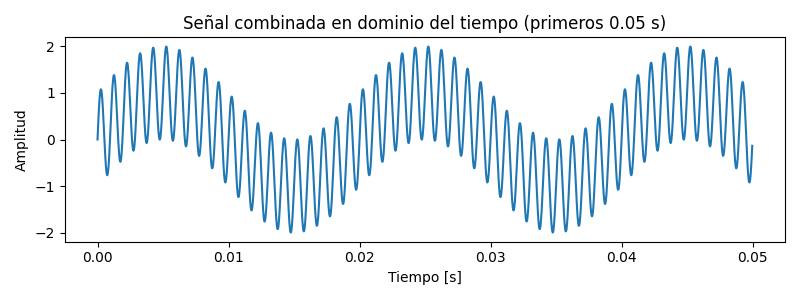
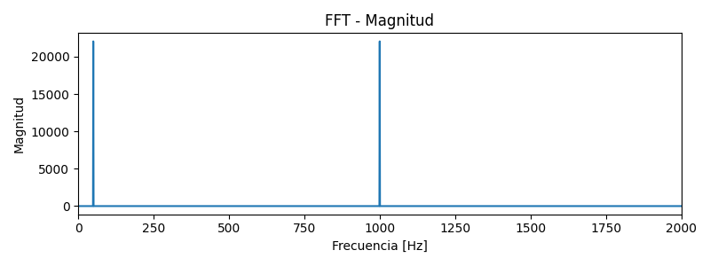

# Explicación de Resultados – Problema 1

A continuación se explican las imágenes generadas para el Problema 1 del proyecto:

---

## 1. Señal combinada en dominio del tiempo (primeros 0.05 s)

- **Descripción:** Esta gráfica muestra la suma de dos señales senoidales: una de 1000 Hz (principal) y otra de 50 Hz (ruido), visualizadas en los primeros 0.05 segundos.
- **Interpretación:** Se observa una señal de alta frecuencia (1000 Hz) modulada por una envolvente de baja frecuencia (50 Hz). Esto ocurre porque la suma de dos senoidales de diferentes frecuencias produce una señal donde la de menor frecuencia modula la amplitud de la de mayor frecuencia.
- **Dominio:** Esta gráfica está en el dominio del tiempo, donde el eje X es el tiempo y el eje Y es la amplitud de la señal.

---

## 2. FFT - Magnitud

- **Descripción:** Esta gráfica muestra la magnitud de la Transformada Rápida de Fourier (FFT) aplicada a la señal combinada, en el rango de 0 a 2000 Hz.
- **Interpretación:** Se observan dos picos principales:
    - Uno en 50 Hz (correspondiente a la señal de ruido)
    - Otro en 1000 Hz (correspondiente a la señal principal)
  Esto indica que la señal original está compuesta por esas dos frecuencias.
- **Dominio:** Esta gráfica está en el dominio de la frecuencia, donde el eje X es la frecuencia (Hz) y el eje Y es la magnitud de cada componente frecuencial.

---

## Explicaciones adicionales

- **¿Por qué aparecen picos en 1000 Hz y 50 Hz?**
  - Porque la señal original es la suma de dos senoidales de esas frecuencias. La FFT identifica y separa las frecuencias presentes en la señal.

- **Diferencia entre dominio del tiempo y frecuencia:**
  - El dominio del tiempo muestra cómo varía la señal a lo largo del tiempo.
  - El dominio de la frecuencia muestra qué frecuencias componen la señal y su magnitud.

- **¿Cómo la FFT separa señales mezcladas?**
  - La FFT descompone cualquier señal en una suma de senoidales de diferentes frecuencias, permitiendo identificar las frecuencias presentes incluso si están mezcladas en el tiempo.
