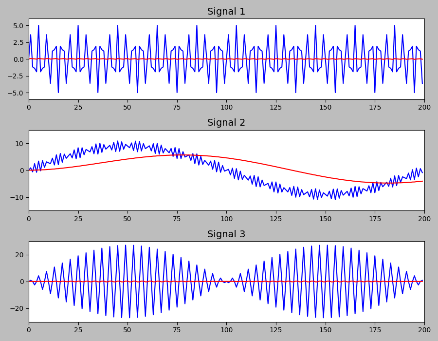

# Explicación de Resultados – Problema 2

A continuación se explican las imágenes generadas para el Problema 2 del proyecto:

---

## Señales originales y filtradas con Filtro Complementario
Las siguientes visualizaciones se han unificado en una sola figura (archivo `ImagesRepo/Problema2_todas_senales.png`). Cada subplot muestra los primeros 200 puntos de la señal original (azul) y la señal filtrada (rojo). A continuación se explica en detalle qué representa cada subplot y por qué cambian las formas de onda al aplicar el filtro complementario.

### Señal 1
- **Qué contiene:** suma de dos senoidales de alta frecuencia: 9000 Hz y 5000 Hz (amplitudes 2 y 3 respectivamente).
- **Por qué se ve así:** al sumar dos senoidales cercanas y de alta frecuencia se obtiene una forma compleja con oscilaciones rápidas y componentes que parecen ruido cuando se muestran pocas muestras.
- **Qué hace el filtro:** el filtro complementario (aF[i] = nA * aV[i] + (1-nA) * aF[i-1], con nA = 0.02) actúa como un suavizado exponencial (similar a un paso bajo simple). Reduce las oscilaciones muy rápidas (alta frecuencia) y deja una versión más estable de la señal (curva roja).
- **Interpretación práctica:** la señal azul muestra el detalle fino; la roja muestra la tendencia general después de atenuar ruido/variaciones rápidas.

---

### Señal 2
- **Qué contiene:** suma de una senoidal muy alta (9000 Hz) y otra de baja frecuencia (100 Hz), con diferencias de amplitud.
- **Por qué se ve así:** la componente de baja frecuencia (100 Hz) crea una envolvente lenta sobre la señal de alta frecuencia; al visualizar pocas muestras se aprecia la oscilación rápida y, a escala mayor, la modulación por la componente lenta.
- **Qué hace el filtro:** al suavizar, el filtro atenúa las oscilaciones rápidas (la componente de 9000 Hz) y resalta la envolvente de baja frecuencia (100 Hz). Por eso la curva roja es más suave y muestra claramente la tendencia de baja frecuencia.
- **Interpretación práctica:** el filtrado ayuda a separar (visualmente) la envolvente de baja frecuencia de las oscilaciones de alta frecuencia.

---

### Señal 3
- **Qué contiene:** producto (multiplicación) de las señales de 5000 Hz y 100 Hz: esto genera una señal modulada (AM) con una envolvente que varía con la componente lenta.
- **Por qué se ve así:** la multiplicación crea envolventes y agrupamientos de ciclos (efecto de amplitud modulada). Ver pocas muestras muestra las oscilaciones internas y la forma de la envolvente.
- **Qué hace el filtro:** el filtro reduce las oscilaciones internas de alta frecuencia y deja la envolvente más clara (curva roja cercana a cero en el centro y con forma suavizada en los extremos).
- **Interpretación práctica:** útil para extraer la tendencia de la señal modulada y estudiar la envolvente en vez del contenido de alta frecuencia.

---

## Detalles técnicos y por qué cambia la forma

- **Filtro complementario usado:** aF[0] = aV[0]; para i>0, aF[i] = nA * aV[i] + (1-nA) * aF[i-1]. Con nA = 0.02 se da más peso al valor anterior; esto implica que la salida cambia lentamente y actúa como un filtro de paso bajo simple.
- **Efecto de `nA`:** valores pequeños (por ejemplo 0.01-0.05) producen mayor suavizado (se atenúan más las variaciones rápidas). Valores grandes (por ejemplo >0.2) dejan más detalle y menos suavizado.
- **Por qué se muestra solo 200 muestras:** para hacer visible el efecto de filtrado en detalle; mostrando pocas muestras es más fácil comparar la señal original con la filtrada.
- **Limitaciones y alternativas:** el filtro complementario es simple y rápido, pero no es selectivo en frecuencia. Para eliminar bandas concretas conviene usar filtros FIR/IIR diseñados (Butterworth, Chebyshev) o filtros en frecuencia (FFT + enmascaramiento).

---

Si quieres, puedo añadir al README la imagen con anotaciones (flechas/picos) o agregar una sección mostrando cómo cambia la salida al variar `nA` (comparativa). ¿Lo quieres?
