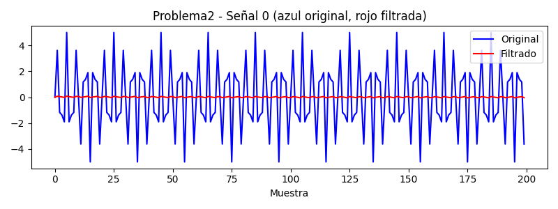
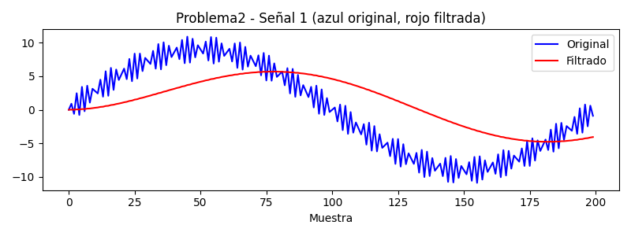
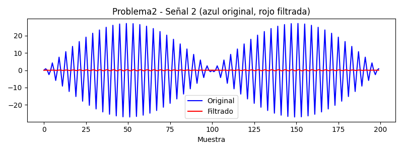

# Explicación de Resultados – Problema 2

A continuación se explican las imágenes generadas para el Problema 2 del proyecto:

---

## Señales originales y filtradas con Filtro Complementario

Las siguientes imágenes muestran los primeros 200 puntos (muestras) de cada señal. El eje X representa el número de muestra.

### Señal 1

- **Descripción:** La curva azul es la señal original (combinación de dos senoidales de 9000 Hz y 5000 Hz). La curva roja es la misma señal tras aplicar el filtro complementario.
- **Interpretación:** El filtro suaviza la señal, reduciendo el ruido de alta frecuencia y estabilizando la forma de onda. Al mostrar solo 200 muestras, la diferencia entre ambas señales es más clara.

---

### Señal 2

- **Descripción:** La curva azul es la señal original (combinación de 9000 Hz y 100 Hz). La curva roja es la señal filtrada.
- **Interpretación:** El filtro complementario elimina parte de las oscilaciones rápidas, dejando una señal más estable. La visualización en muestras permite apreciar mejor el efecto del filtrado.

---

### Señal 3

- **Descripción:** La curva azul es la señal original (producto de 5000 Hz y 100 Hz). La curva roja es la señal filtrada.
- **Interpretación:** El filtro reduce el ruido y suaviza la señal, haciendo más visible la tendencia general. El uso de muestras en el eje X facilita la comparación visual.

---

## Explicaciones adicionales

- **¿Qué es un filtro complementario?**
  - Es un filtro que combina componentes de alta y baja frecuencia para obtener una señal más estable y menos ruidosa.

- **¿Qué mejora?**
  - Reduce el ruido y estabiliza la señal, permitiendo observar mejor la tendencia principal de la señal original.
